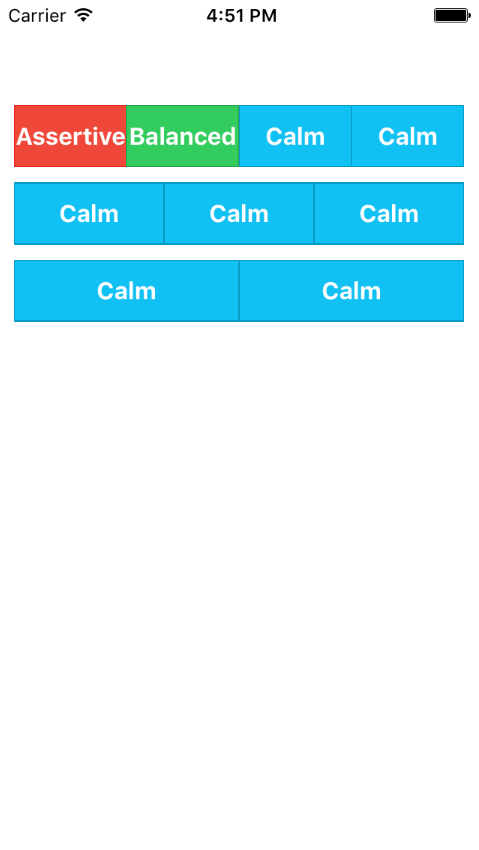

#Button
####example:
<pre>
import React, {
    AppRegistry,
    Component,
    View,
    Image
} from 'react-native';

import ButtonBar from './src/ButtonBar'

import {ButtonStable,
    ButtonAssertive,
    ButtonBalanced,
    ButtonCalm,
    ButtonDark,
    ButtonEnergized,
    ButtonLight,
    ButtonPositive,
    ButtonRoyal} from './src/Button'

class ReactNativeUI extends Component {
    render() {
        return (
            &lt;View&gt;
                &lt;ButtonBar&gt;
                    &lt;ButtonAssertive&gt;Assertive&lt;/ButtonAssertive&gt;
                    &lt;ButtonBalanced&gt;Balanced&lt;/ButtonBalanced&gt;
                    &lt;ButtonCalm&gt;Calm&lt;/ButtonCalm&gt;
                    &lt;ButtonCalm&gt;Calm&lt;/ButtonCalm&gt;
                &lt;/ButtonBar&gt;
                &lt;ButtonBar&gt;
                    &lt;ButtonCalm&gt;Calm&lt;/ButtonCalm&gt;
                    &lt;ButtonCalm&gt;Calm&lt;/ButtonCalm&gt;
                    &lt;ButtonCalm&gt;Calm&lt;/ButtonCalm&gt;
                &lt;/ButtonBar&gt;
                &lt;ButtonBar&gt;
                    &lt;ButtonCalm&gt;Calm&lt;/ButtonCalm&gt;
                    &lt;ButtonCalm&gt;Calm&lt;/ButtonCalm&gt;
                &lt;/ButtonBar&gt;

            &lt;/View&gt;
        );
    }
}
</pre>
####preview:

